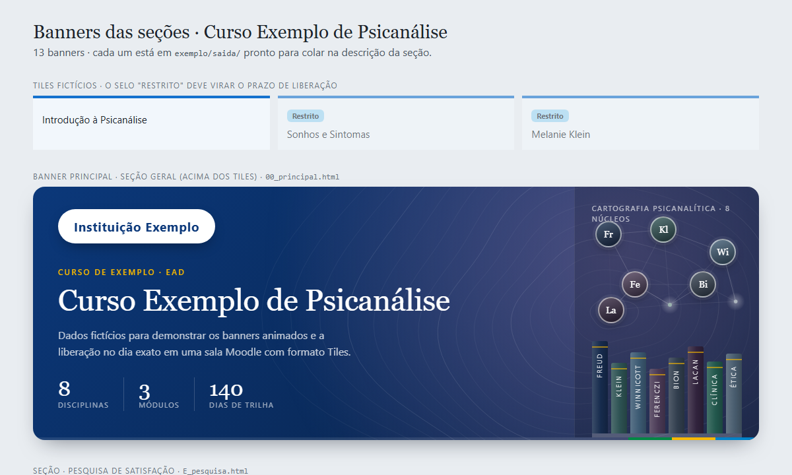
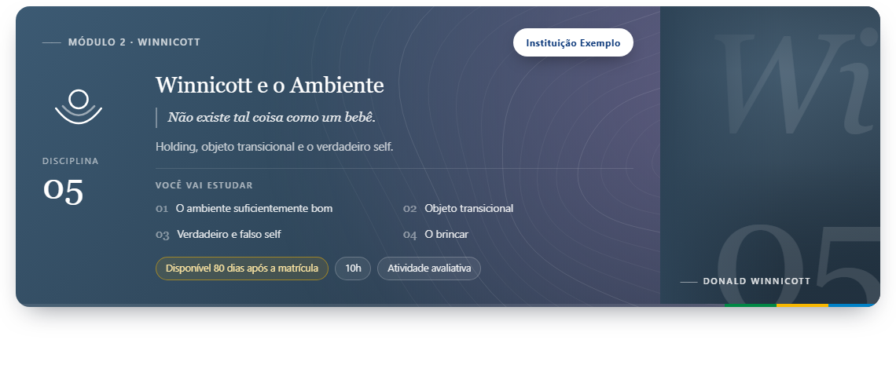

# moodle-tiles-liberacao-exata

Banners animados e um script de sala para **Moodle 3.11 com o formato Tiles**. O script libera cada seção do curso **no dia exato** (matrícula + N dias), mesmo quando o plugin de restrição não aceita esse número de dias.

Tudo funciona a partir da **descrição das seções**: sem plugin novo, sem acesso de administrador e sem ids fixos. Por isso a mesma sala pode ser copiada para quantas turmas forem necessárias.





> Os banners das imagens são gerados a partir de [`banners/dados.exemplo.json`](banners/dados.exemplo.json), com instituição, curso e textos fictícios.

---

## Por que existe

O plugin **Data relativa** (`availability_relativedate`) libera uma seção "N dias após a matrícula", mas o campo do número tem um limite. Acima dele, só dá para usar semanas, e o resultado nunca cai no dia certo.

| Liberação desejada | No plugin | O servidor libera |
|---|---|---|
| 20 dias | 20 dias | no dia 20 ✔ |
| 80 dias | 11 semanas | no dia 77 (3 dias antes) |
| 160 dias | 22 semanas | no dia 154 (6 dias antes) |

O projeto configura o plugin com semanas **arredondadas para baixo**, para que o servidor nunca libere depois do dia certo. Depois, um script embutido nos próprios banners **segura a seção até o dia exato**, com a mesma aparência da restrição nativa.

## Funcionalidades

**Banners**
- Fragmentos HTML com estilos inline e animações (canvas e SVG), prontos para colar na descrição das seções.
- O runtime vai empacotado em base64, para que os filtros de texto do Moodle (URLs, emoticons, glossário) e o editor não alterem o código.
- Sem JavaScript, o banner continua completo, só estático.

**Script da sala** (`psi-sala.js`)
- **Data de matrícula por aluno:** lida do tooltip do tile restrito (o Moodle calcula a data por usuário) e guardada em cache por curso + usuário.
- **Tile na folga:** fica travado com a mesma marcação do tile restrito do Tiles (pílula "Libera dd/mm/aaaa", cadeado e tooltip "Restrito · Disponível se: De …" com dia e hora).
- **Seção aberta por link:** a própria seção se trava. As atividades ficam ocultas até a data ser conferida; sem cache, o script consulta a página inicial do curso.
- **Navegação:** setas, links e o menu "Ir para" que apontam para uma seção travada levam à seção **Pesquisa de Satisfação** (ou à última disciplina liberada).
- **Menu lateral:** a disciplina travada não aparece até o dia exato.
- **Salas replicáveis:** nada de cmid ou id fixo; o script reconhece as seções pelo nome.
- **Diagnóstico:** `?psiDebug=1` mostra os cálculos no console; `&psiAgora=AAAA-MM-DD` simula a data.

Detalhes: [doc/SALA_SCRIPT.md](doc/SALA_SCRIPT.md).

## Estrutura

```
banners/
  gerar.js              gerador dos banners
  dados.exemplo.json    dados fictícios (o dados.json real fica fora do git)
  src/psi-banners.js    runtime de animação
  src/psi-sala.js       script da sala (liberação no dia exato)
  tratar-imagens.ps1    padroniza retratos (arco e medalhão)
exemplo/                banners e prévia gerados a partir dos dados de exemplo
testes/                 testes automatizados (jsdom)
doc/
  SALA_SCRIPT.md        funcionamento, instalação e diagnóstico
  HISTORICO.md          versões, falhas encontradas e como foram resolvidas
img/                    pastas para logo, retratos e temas (as imagens não são versionadas)
```

## Como usar

**Pré-requisito:** Node.js 18 ou superior.

1. Copie `banners/dados.exemplo.json` para `banners/dados.json` e preencha com o seu curso:
   - marca (nome e logo);
   - disciplinas, com os dias de liberação;
   - seções especiais (apresentação, encontro ao vivo, prática e pesquisa; na pesquisa, `avaliados` lista o que o aluno avalia e `fecho` é a mensagem final);
   - agenda do encontro ao vivo;
   - `divisores` (cabeçalhos dos blocos de cada disciplina) e `atividades` (sigla do curso e modelo do nome dos questionários).
2. (Opcional) Coloque as fotos em `img/psicanalistas/` e `img/temas/` e rode `banners/tratar-imagens.ps1`. Sem foto, o banner usa um monograma.
3. Gere os banners:

   ```
   node banners/gerar.js
   ```

   A saída fica em `banners/saida/` (um arquivo por seção) e a prévia em `banners/preview.html`. Os divisores ficam em `banners/saida/divisores/` e os nomes dos questionários em `banners/saida/nomes_questionarios.md`.

Para gerar o exemplo:

```
node banners/gerar.js --dados=banners/dados.exemplo.json --saida=exemplo/saida --preview=exemplo/preview.html
```

## Instalação no Moodle

1. **Banners:** em cada seção, abra **Editar seção** e, na descrição, use o editor HTML em modo código para colar o arquivo correspondente de `banners/saida/`. O banner principal vai na seção Geral. Depois de salvar, confira se o `<script>` final continua lá.
2. **Restrição:** em cada seção, use **Data relativa** após a data de inscrição do usuário. Use dias até o limite do campo (`MAX_DIAS` em `gerar.js`) e, acima dele, semanas arredondadas para baixo. A tabela completa está em [doc/SALA_SCRIPT.md](doc/SALA_SCRIPT.md).
3. **Pesquisa de Satisfação:** crie uma seção com esse nome e cole o banner `E_pesquisa`.
4. **Divisores:** em cada disciplina, crie dois **Rótulos** e cole `<disciplina>_material.html` acima das unidades e `<disciplina>_questionario.html` acima do questionário.
5. **Questionários:** use o nome e o número de identificação de `nomes_questionarios.md` (`Questionário 07 · <título>` e `SIGLA-D07-QST`).
6. **Validação:** entre com um aluno de teste e use `?psiDebug=1`.

## Testes

```
cd testes
npm install
npm test
```

O `npm test` gera os banners de exemplo e roda 30 verificações:
- trava dos tiles e data exata;
- seção aberta por link, com e sem cache;
- navegação desviada para a Pesquisa e menu lateral;
- quadro de animação com tempo negativo, que reproduz uma falha corrigida na v6 do runtime.

## Limitações conhecidas

- O link direto de uma **atividade** (`mod/…/view.php`) não carrega o banner da seção. Por isso, nos dias de folga (no máximo 6), a atividade abre. Fechar esse caso exige o script no HTML adicional do site ou outra condição na restrição.
- Feito e testado no Moodle 3.11 com o formato Tiles. Outras versões podem usar outra marcação; os seletores ficam no topo de `psi-sala.js`.

## Histórico

As versões, as falhas encontradas e as decisões tomadas estão em [doc/HISTORICO.md](doc/HISTORICO.md).

## Licença

Todos os direitos reservados. O código pode ser visualizado, mas não pode ser usado, copiado, modificado ou distribuído sem autorização por escrito. Veja [LICENSE](LICENSE).

---

### English summary

Animated section banners and a room script for **Moodle 3.11 with the Tiles course format**. The script releases each section on the **exact day** (enrolment + N days), working around the field limit of the *Relative date* availability plugin.

The server is configured in whole weeks, rounded down, and the script holds the section until the exact date. It reproduces the native restricted-tile look, locks sections opened by direct link, redirects navigation and hides locked sections from the side menu.

No plugins, no admin access and no hard-coded ids are needed, so the course can be duplicated freely. Example data is fictitious.

All rights reserved: the code is published for viewing only (see [LICENSE](LICENSE)).
